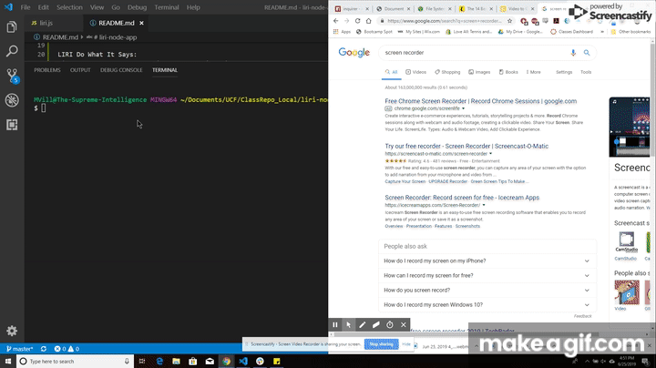

# liri-node-app
LIRI will search Spotify for songs, Bands in Town for concerts, and OMDB for movies

Functionality is as follows:

When called upon, liri will take in one of four commands: concert-this, movie-this, do-what-it-says, and spotify-this-song. Each time a function gets called another function called appendCommand logs it to the log.txt file.
  

LIRI Concert This:
 

  
As seen on the .gif above, the terminal takes in the command "concert-this" and the user input string to determine where an artist is playing their next show.
  

LIRI Movie This:
 

  
As seen on the .gif above, the terminal takes in the command "movie-this" and the user input string to obtain data from OMDB. It then displays the results neatly.
  

LIRI Spotify This Song:
 

  
As seen on the .gif above, the terminal takes in the command "spotify-this-song" and returns a neat console.log that displays information about the song.
  

LIRI Do What It Says:
 

  
In this .gif the terminal command will read the file "random.txt" and take in the data from that file. The data will be split into an array that will allow the first part of the array to be read as the function, and which will then allow the second part to be read as the input string.
  

BONUS:

Append Command:
 

  
In this .gif I demonstrate how the function appendCommand appends the file log.txt to include all of the commands that have been run so far.